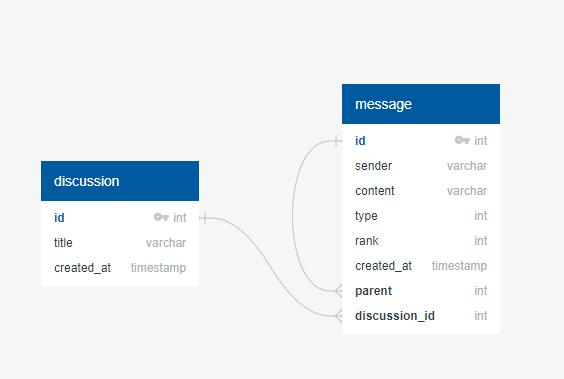

# Database Documentation

## Introduction
This project implements a discussion forum and utilizes a SQLite database to store discussions and messages.

## Database Schema
The following database schema has been implemented:

- `discussion`: table to store discussion information including id and title.
- `message`: table to store message information including id, sender, content, type, rank, parent, and discussion_id. The type column is an integer representing the type of the message. The rank column is an integer representing the rank of the message. The parent column is an integer representing the id of the parent message. The discussion_id column is a foreign key referencing the id column in the discussion table.

## Database Upgrades
The database schema is currently at version 2. The following upgrades have been made to the schema:

In version 1, three columns have been added to the message table: type, rank, and parent.
In version 2, the parent column has been added to the message table (if it doesn't already exist).
Encoding
The encoding of the database is checked before creating/updating the schema. If the current encoding is not UTF-8, it is changed to UTF-8.

## Implementation Details
The create database schema script is responsible for creating/updating the database schema. It first checks the encoding of the database and changes it to UTF-8 if necessary. Then, it checks if the required tables (discussion, message, and schema_version) exist. If any of these tables do not exist, they are created. The schema version is retrieved from the schema_version table. If the table is empty, version 0 is assumed. Otherwise, the version from the table is used. If the version is less than the current version, the schema is upgraded to the current version by adding the necessary columns to the message table. Finally, the schema version is updated or inserted into the schema_version table.

## Documentation:

The DiscussionDB class provides methods to manipulate the database and retrieve information about discussions and messages. Here are the methods available in this class:
```
select(query, params=None, fetch_all=True)
```

This method executes an SQL select query on the database with optional parameters. It returns the cursor object for further processing. If fetch_all is True, it returns all the rows returned by the query, else it returns only the first row.

```
delete(query, params=None)
```

This method executes an SQL delete query on the database with optional parameters. It returns the cursor object for further processing.

```
insert(query, params=None)
```

This method executes an SQL insert query on the database with optional parameters. It returns the ID of the newly inserted row.

```
update(query, params=None)
```

This method executes an SQL update query on the database with optional parameters.

```
load_last_discussion()
```

This method retrieves the last discussion in the database or creates a new one if there are no discussions. It returns a Discussion instance for the retrieved or created discussion.

```
create_discussion(title="untitled")
```

This method creates a new discussion with the specified title. It returns a Discussion instance for the newly created discussion.

```
build_discussion(discussion_id=0)
```

This method retrieves the discussion with the specified ID or creates a new one if the ID is not found. It returns a Discussion instance for the retrieved or created discussion.

```
get_discussions()
```

This method retrieves all discussions in the database. It returns a list of dictionaries, where each dictionary represents a discussion and contains the discussion's ID and title.

```
does_last_discussion_have_messages()
```

This method checks if the last discussion in the database has any messages. It returns True if the last discussion has at least one message, else False.

```
remove_discussions()
```

This method removes all discussions and messages from the database.

```
export_to_json()
```

This method exports all discussions and messages in the database to a JSON file. It returns a list of dictionaries, where each dictionary represents a discussion and contains the discussion's ID, title, and messages. Each message is represented by a dictionary with the sender, content, type, rank, and parent fields.


## Database diagram
